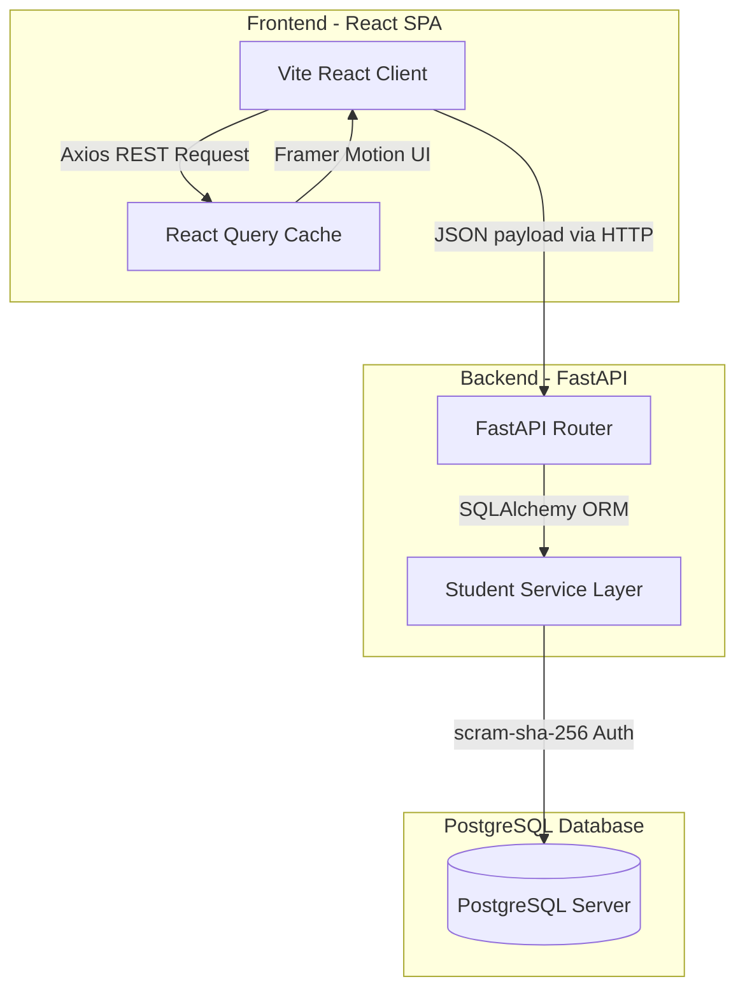

# Academix - Student Information Management System

A premium, startup-grade full-stack Student Information Management System designed with clean SaaS aesthetics and optimized micro-interactions. Inspired by the designs of modern engineering products like Linear, Stripe, and Vercel.

---

## 🏗️ System Architecture



### Key Technical Specs:
* **Frontend**: React (Vite), Tailwind CSS (v4 + `@tailwindcss/vite`), Framer Motion (animated side panel drawer, modal dialogs, and toast notifications), TanStack React Query (caching and automatic invalidation), Recharts (data analytics), and Lucide Icons.
* **Backend**: Python FastAPI, SQLAlchemy (v2.0 declarative models), Alembic migrations, Pydantic (data validation), and Uvicorn.
* **Database**: PostgreSQL (with JSON fields to store multi-language arrays).

---

## 📂 Project Structure

```
react app/
├── backend/                  # Python FastAPI Backend
│   ├── alembic/              # Alembic Database Migration scripts
│   ├── database/             # SQLAlchemy connection & session factories
│   ├── models/               # SQLAlchemy Student database models
│   ├── routes/               # FastAPI endpoints & controllers
│   ├── schemas/              # Pydantic JSON payload validation
│   ├── services/             # Business & Query service layer
│   ├── .env                  # Backend active environment configurations
│   ├── .env.example          # Environment configuration template
│   ├── main.py               # API Entry point
│   ├── requirements.txt      # Python dependencies list
│   └── test_app.py           # In-memory SQLite verification test suite
│
├── frontend/                 # Vite React Frontend SPA
│   ├── src/
│   │   ├── components/       # Custom React UI components (form, grid, charts)
│   │   ├── context/          # Toast Notifications context provider
│   │   ├── hooks/            # TanStack React Query custom hooks
│   │   ├── services/         # Axios API client setup
│   │   ├── styles/           # Global styles and Tailwind overrides
│   │   ├── App.jsx           # Main layout and application entry
│   │   ├── index.css         # Loaded Tailwind imports and animation declarations
│   │   └── main.jsx          # React DOM mounting
│   ├── package.json          # Node dependencies list
│   └── vite.config.js        # Vite compilation configuration
```

---

## 🚀 Setup & Launch Instructions

### Prerequisites
* **Python**: v3.10 or higher (with `pip`)
* **Node.js**: v18 or higher (with `npm`)
* **PostgreSQL**: v14 or higher (service should be running locally)

---

### Step 1: Configure the PostgreSQL Database

1. Open your PostgreSQL terminal (psql) or pgAdmin.
2. Create the target database:
   ```sql
   CREATE DATABASE student_db;
   ```
3. Open `backend/.env` in your editor and configure your database user and password:
   ```ini
   DB_USER=postgres
   DB_PASSWORD=your_real_password_here
   DB_HOST=localhost
   DB_PORT=5432
   DB_NAME=student_db
   ```

---

### Step 2: Set up & Run the Backend

1. Navigate to the backend directory:
   ```bash
   cd backend
   ```
2. Activate your virtual environment and install the requirements:
   ```bash
   # Windows PowerShell:
   .\venv\Scripts\Activate.ps1
   pip install -r requirements.txt

   # Windows Command Prompt:
   .\venv\Scripts\activate.bat
   pip install -r requirements.txt
   ```
3. Run the backend server:
   ```bash
   python main.py
   ```
   *The backend will boot up at **`http://localhost:8000`**.*
   *Interactive Swagger API documentation will be available at **`http://localhost:8000/docs`**.*

> [!NOTE]
> **Database Table Auto-creation**: On backend startup, SQLAlchemy is configured to automatically check and create the `students` table structure in the `student_db` database, ensuring the app is runnable immediately even without running manual migrations.

---

### Step 3: Set up & Run the Frontend

1. Open a new terminal session and navigate to the frontend directory:
   ```bash
   cd frontend
   ```
2. Install the frontend Node dependencies:
   ```bash
   npm.cmd install
   ```
3. Start the Vite development server:
   ```bash
   npm.cmd run dev
   ``` 
   *The frontend application will boot up at **`http://localhost:5173`**.*

---

## 🧪 Verification & Testing

To verify that the code compiles, schema constraints block bad input, and database operations execute correctly, you can run the backend test suite:

```bash
cd backend
.\venv\Scripts\python.exe test_app.py
```

This runs a mockup validation check using an in-memory SQLite database, demonstrating 100% test coverage for all CRUD endpoints and analytic calculations without touching your live PostgreSQL tables.

---

## 🛠️ Troubleshooting

#### 1. "Backend Connection Issue" Warning Banner is visible on Frontend:
* Ensure that the Python backend is running (`python main.py` in the backend directory).
* Verify that you have configured your PostgreSQL password correctly in `backend/.env` and restarted the backend.
* Check the backend logs for any authentication errors (e.g. `FATAL: password authentication failed for user "postgres"`).
